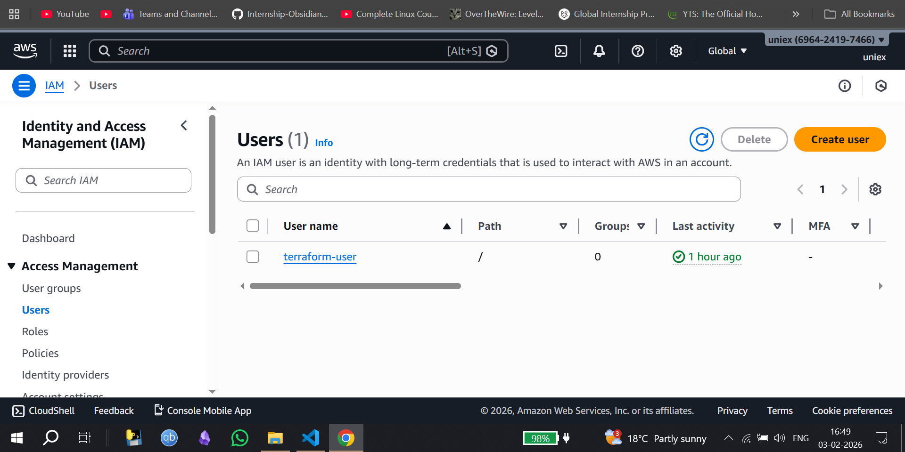
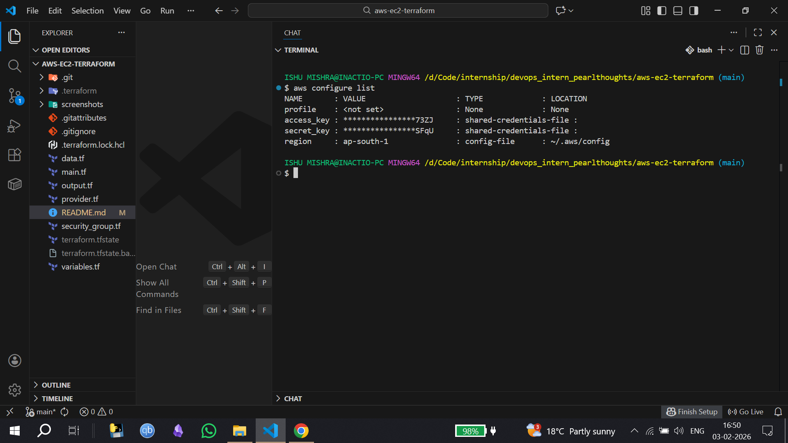
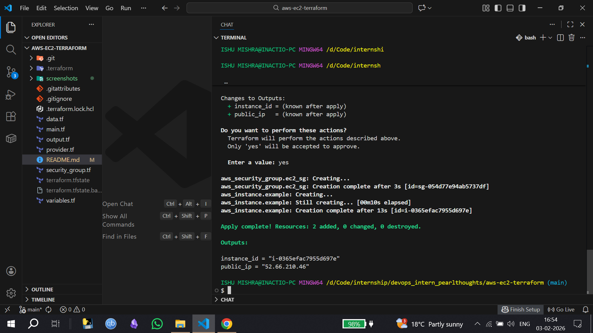
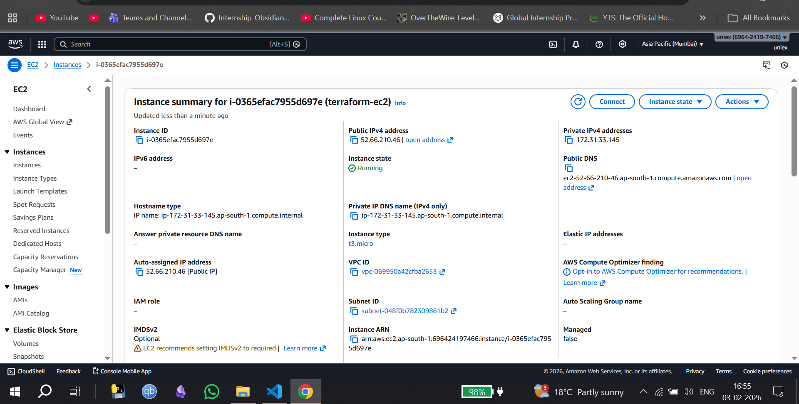

# Task 2 : AWS EC2 + Terraform — What I Learned by Doing

## Context
Today’s task was to get familiar with AWS core concepts and Terraform by actually launching EC2 instances — first manually from the AWS Console and then using Infrastructure as Code.
Instead of just reading docs, I treated this as a hands-on exploration of how AWS networking and compute actually fit together.

## Starting with AWS Basics (What clicked for me)
Before touching Terraform, I explored the AWS Console to understand what really happens when an EC2 instance is launched.

## A few things became clear very quickly:
- An EC2 instance cannot exist on its own
- It always lives inside a VPC
- It must be placed in a subnet
- And it must be protected by a security group

This made VPCs, subnets, and security groups feel less like abstract concepts and more like mandatory building blocks.

## Launching an EC2 Instance Manually

I first launched an EC2 instance directly from the AWS Console.
While doing this, I paid attention to:

- Which AMI I was selecting
- Which instance types were allowed under my account
- How security groups control inbound SSH access
- How AWS automatically attaches networking when using the default VPC
### AWS Console – Launch Instance


### Create Key Pair


### Allow SSH Traffic (My IP)


### Instance Running State


The instance launched successfully, and seeing it move into the Running state made the architecture feel real instead of theoretical

## Accessing the Instance through SSH 

In terminal :
```
ssh -i test_sample.pem ubuntu@IPv4 address

```
### Instance running through SSH 


## EC2 Provisioning Using Terraform (Hands-on Learnings)

After launching an EC2 instance manually, I provisioned an EC2 instance using Terraform to understand Infrastructure as Code in a practical way.

## IAM User & AWS CLI Setup

To avoid using root credentials, I created a dedicated IAM user with programmatic access and the required permissions for EC2 and networking.

I then configured AWS locally using:

```
aws configure
```
This allowed Terraform to authenticate with AWS using the configured IAM credentials.

### IAM user creation


### aws configure


## Terraform Configuration

The Terraform setup was structured into logical files to map AWS concepts clearly:
- Provider configuration
- Security group for SSH access
- EC2 instance definition
- Output for public IP
This helped keep the configuration readable and modular.

## Applying Terraform

Terraform was initialized and applied using:

```
terraform init
terraform apply
```

## Verification

The EC2 instance was verified in the AWS Console to ensure:
- Instance state was running
- Security group was attached
- Public IP was assigned

### EC2 provision through Terraform


### EC2 created through Terraform


## Cleanup

After verification, all resources were removed using:
```
terraform destroy
```
This reinforced the importance of cost control and clean infrastructure teardown.

## Key Takeaways
- IAM users are essential for secure automation
- AWS CLI bridges local tools with AWS
- Terraform reflects real AWS constraints, including billing
- Infrastructure becomes repeatable and manageable with IaC