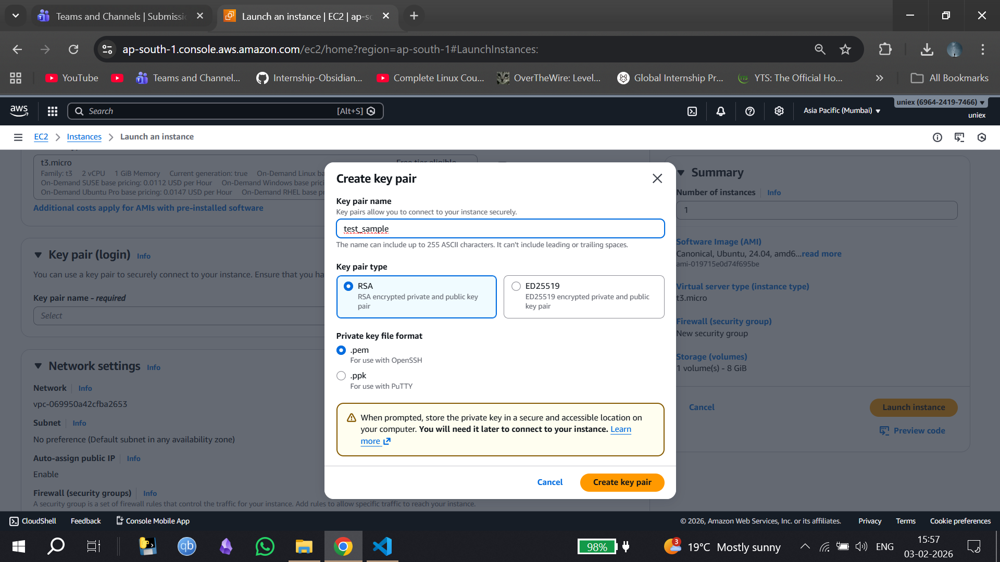
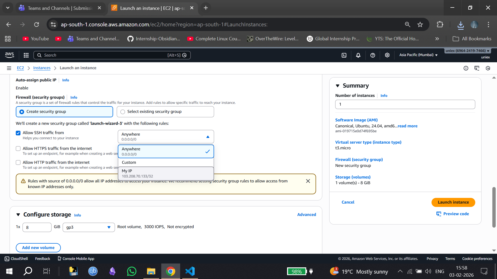
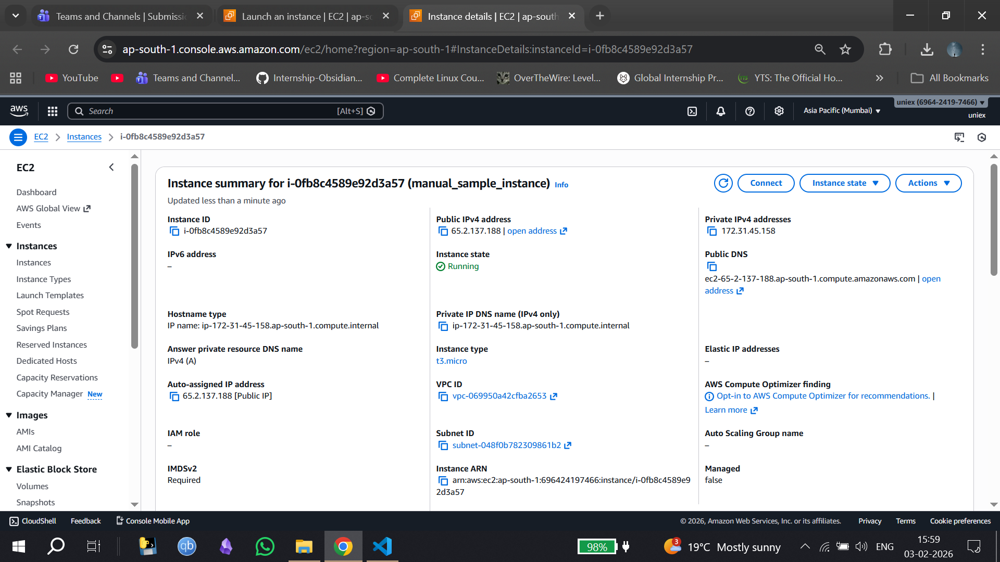
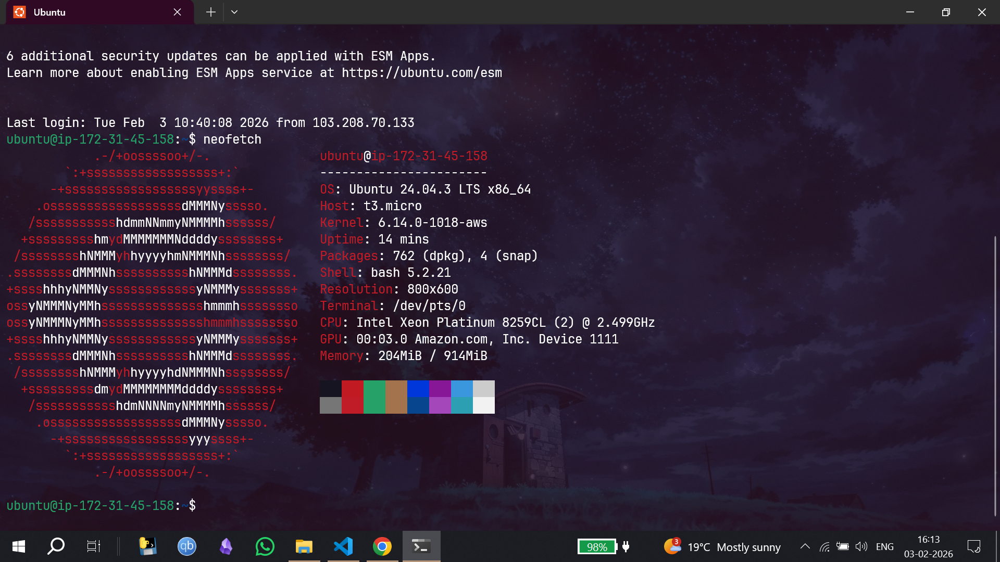

# Task 2 : AWS EC2 + Terraform — What I Learned by Doing

## Context
Today’s task was to get familiar with AWS core concepts and Terraform by actually launching EC2 instances — first manually from the AWS Console and then using Infrastructure as Code.
Instead of just reading docs, I treated this as a hands-on exploration of how AWS networking and compute actually fit together.

## Starting with AWS Basics (What clicked for me)
Before touching Terraform, I explored the AWS Console to understand what really happens when an EC2 instance is launched.

## A few things became clear very quickly:
- An EC2 instance cannot exist on its own
- It always lives inside a VPC
- It must be placed in a subnet
- And it must be protected by a security group

This made VPCs, subnets, and security groups feel less like abstract concepts and more like mandatory building blocks.

## Launching an EC2 Instance Manually

I first launched an EC2 instance directly from the AWS Console.
While doing this, I paid attention to:

- Which AMI I was selecting
- Which instance types were allowed under my account
- How security groups control inbound SSH access
- How AWS automatically attaches networking when using the default VPC
### AWS Console – Launch Instance


### Create Key Pair


### Allow SSH Traffic (My IP)


### Instance Running State


The instance launched successfully, and seeing it move into the Running state made the architecture feel real instead of theoretical

## Accessing the Instance through SSH 

In terminal :
```
ssh -i test_sample.pem ubuntu@IPv4 address

```
### Instance running through SSH 



## Moving to Terraform (Infrastructure as Code)
Once I understood the manual flow, I moved to Terraform.
The goal here was not just to “make it work”, but to understand:

- How AWS concepts map to Terraform resources
- How Terraform talks to AWS using the provider
- How state is tracked locally

I structured the project so each concern was separated:

- Provider configuration
- Security group definition
- EC2 instance definition
- Outputs